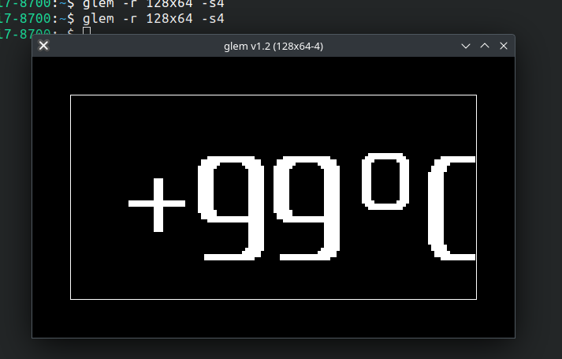

# README

Графическая библиотека для рисования графики и шрифтов на мелких монохромных дисплеях. Основана
на библиотеке [ST7565r_or_GMG12864_CMSIS](https://github.com/Solderingironspb/ST7565r_or_GMG12864_CMSIS).

Для откладки на linux десктопе можно испозовать [эмулятор монохромного дисплея](https://github.com/Mcublog/glem).
По сути окно принимаеющие данные через сокет и отрисовывает по пикселям.

## Пример подключения

## Полезные ссылки

* [GLEM](https://github.com/Mcublog/glem)
* Материалы из видео **[[Скачать]](https://github.com/Solderingironspb/Lessons-Stm32/archive/Practice%2311.zip)**
* [Главная страница](https://github.com/Solderingironspb/Lessons-Stm32/blob/master/README.md)
