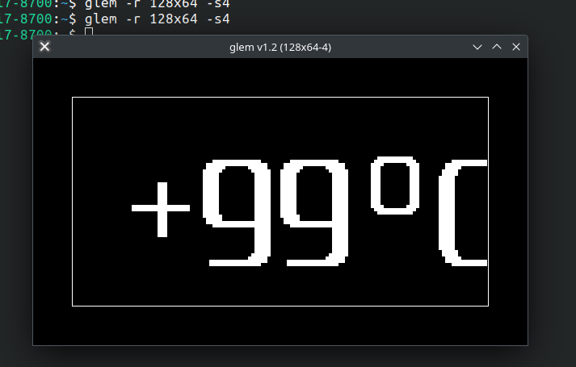

# README

Графическая библиотека для рисования графики и шрифтов на мелких монохромных дисплеях. Основана
на библиотеке [ST7565r_or_GMG12864_CMSIS](https://github.com/Solderingironspb/ST7565r_or_GMG12864_CMSIS).

Для откладки на linux десктопе можно испозовать [эмулятор монохромного дисплея](https://github.com/Mcublog/glem).
По сути окно принимаеющие данные через сокет и отрисовывает по пикселям.



## Пример подключения


## Полезные ссылки

* [GLEM](https://github.com/Mcublog/glem)
* Материалы из видео **[[Скачать]](https://github.com/Solderingironspb/Lessons-Stm32/archive/Practice%2311.zip)**
* [Главная страница](https://github.com/Solderingironspb/Lessons-Stm32/blob/master/README.md)

## Виджет меню (GMG12864menu)

Меню с прокруткой, скроллбаром и стилями подсветки `GMG_MENU_SELECTOR` (курсор `>`),
`GMG_MENU_INVERSE` (инверсия) и `GMG_MENU_FRAME` (рамка). Подсветка выделенного пункта
может мигать — для этого `GMG12864_Tick()` нужно вызывать раз в 1 мс (SysTick, таймер,
RTOS):

```c
#include "gmg12864menu.h"

static const gmg_menu_item_t items[] = {
    {"Volume", 10, true},
    {"Brightness", 20, true},
    {"Reset", 80, true},
};

gmg_menu_t menu;
GMG_Menu_Init(&menu, items, 3, 0, 12, 0, 3, GMG_MENU_INVERSE, true);
GMG12864_Blink_Set_period(500);
GMG12864_Blink_Enable(true);

GMG_Menu_Down(&menu);              // Двигаем выделение
GMG_Menu_Draw(&menu);              // Рисуем (кадр перед этим очистить)
GMG12864_Update();
printf("value: %d\n", GMG_Menu_Get_value(&menu));
```

### Чтение выбранного пункта

Виджет не хранит значения сам — только индекс выбранного пункта в вашем массиве.
После навигации результат забирается геттерами:

```c
GMG_Menu_Down(&menu);                 // выделение ходит по кругу,
                                      // пункты с enabled == false пропускает
uint8_t      v = GMG_Menu_Get_value(&menu);     // value выбранного пункта
uint8_t      i = GMG_Menu_Get_selected(&menu);  // его индекс в items
const char  *t = GMG_Menu_Get_text(&menu);      // его текст

switch (v) {
case 10: /* Volume */ break;
}
```

Несколько моментов:

- `items` передаётся указателем и остаётся `const` — массив должен быть `static`
  и жить всё время работы меню. Виджет меняет только `selected`/`top` внутри
  вашей структуры `gmg_menu_t`.
- `value` — это `uint8_t`-метка пункта для `switch/case`, а не редактируемая
  переменная. Чтобы показать текущее значение настройки (громкость, яркость),
  рисуйте его сами рядом с меню, например `GMG12864_Sprintf(...)`.
- `width = 0` в `GMG_Menu_Init` — ширина считается автоматически по самому
  длинному пункту (+ место под курсор `>` для `SELECTOR`, + скроллбар при
  прокрутке). `visible_rows = 0` — показывать все пункты.
- Поля `menu.selected`/`menu.top` лучше не менять напрямую: прокрутку (`top`)
  пересчитывает внутренняя корректировка при `GMG_Menu_Up/Down`.

Печать с инверсией (текст «вырезается» из белой подложки, которую нужно закрасить
заранее):

```c
GMG12864_Draw_rectangle_filled(0, 48, 60, 8, inversion_on);
GMG12864_Puts_inv(1, 48, inversion_on, "Inverted");
```

## Запуск примера на эмуляторе

```sh
# собрать и установить эмулятор (один раз)
git clone https://github.com/Mcublog/glem && cd glem && make && sudo make install

# собрать пример
cmake -B build && cmake --build build

# запустить сервер эмулятора и пример
glem -r 128x64 -s4 &
./build/example/glem/example_glem
```

Управление в примере: `w`/`s` — перемещение, `a`/`d` — выбор активного меню,
`b` — вкл/выкл мигание, `1`/`2`/`3` — стиль подсветки, `q` — выход.
